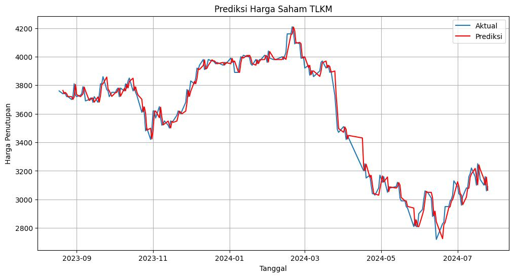

# Identifikasi Pergerakan dan Peramalan Saham TLKM Menggunakan ARIMA

## Deskripsi
Proyek ini menganalisis pergerakan harga saham Telkom Indonesia (TLKM) dan melakukan peramalan harga penutupan menggunakan metode ARIMA. Dataset diambil dari Yahoo Finance mulai 1 Januari 2020 hingga 26 Juli 2024.

## Data
Data yang digunakan mencakup harga pembukaan, tertinggi, terendah, penutupan, volume, dan adjusted close saham TLKM. Data diperoleh melalui library `yfinance`.

## Tahapan Analisis

### 1. Cek Stasioneritas
- Uji **ADF** dilakukan untuk memeriksa apakah data stasioner.
- Hasil: p-value = 0.34 → data tidak stasioner.
- Lakukan **differencing** 1 kali → data menjadi stasioner (p-value < 0.05).

### 2. Analisis Autokorelasi
- Plot **ACF** dan **PACF** sebelum dan sesudah differencing.
- Digunakan untuk menentukan ordo ARIMA secara manual.

### 3. Penentuan Model ARIMA
- **Manual:** ARIMA(1,1,1)
- **Otomatis:** Menggunakan `pmdarima.auto_arima` → ARIMA(5,1,0)
- Model dibandingkan berdasarkan AIC untuk memilih yang terbaik.

### 4. Fitting Model
- Fitting model ARIMA menggunakan `statsmodels.tsa.arima.model.ARIMA`.
- Model 1: ARIMA(1,1,1)
- Model 2: ARIMA(5,1,0)

### 5. Forecasting
- Data dibagi menjadi training (80%) dan testing (20%).
- Prediksi dilakukan pada data testing menggunakan model ARIMA(1,1,1).
- Transformasi prediksi ke skala asli menggunakan differencing invers.
- Visualisasi hasil prediksi dibandingkan dengan data aktual.

## Hasil Forecast
Berikut cuplikan hasil prediksi harga penutupan saham TLKM dibandingkan data aktual:

| Date       | Aktual  | Prediksi     |
|------------|--------:|-------------:|
| 2023-08-18 | 3760.0  | NaN          |
| 2023-08-21 | 3740.0  | 3763.43      |
| 2023-08-22 | 3750.0  | 3740.82      |
| 2023-08-23 | 3740.0  | 3749.29      |
| 2023-08-24 | 3720.0  | 3740.31      |
| ...        | ...     | ...          |
| 2024-07-19 | 3140.0  | 3211.39      |
| 2024-07-22 | 3100.0  | 3142.87      |
| 2024-07-23 | 3160.0  | 3101.28      |
| 2024-07-24 | 3060.0  | 3156.18      |
| 2024-07-25 | 3090.0  | 3064.34      |

- Plot visualisasi aktual vs prediksi dapat ditambahkan di bawah ini:  
  

## Library yang Digunakan
- `yfinance` → untuk download data saham.
- `pandas` → manipulasi data.
- `matplotlib` → visualisasi.
- `statsmodels` → fitting model ARIMA.
- `pmdarima` → auto_arima.

## Kesimpulan
- Model ARIMA(1,1,1) mampu menangkap tren jangka pendek harga saham TLKM dengan cukup baik.
- Model auto_arima (ARIMA 5,1,0) memberikan model lebih kompleks berdasarkan AIC.
- Visualisasi prediksi menunjukkan bahwa model sederhana bisa mendekati pola pergerakan aktual, meskipun beberapa deviasi terjadi pada fluktuasi tajam.
